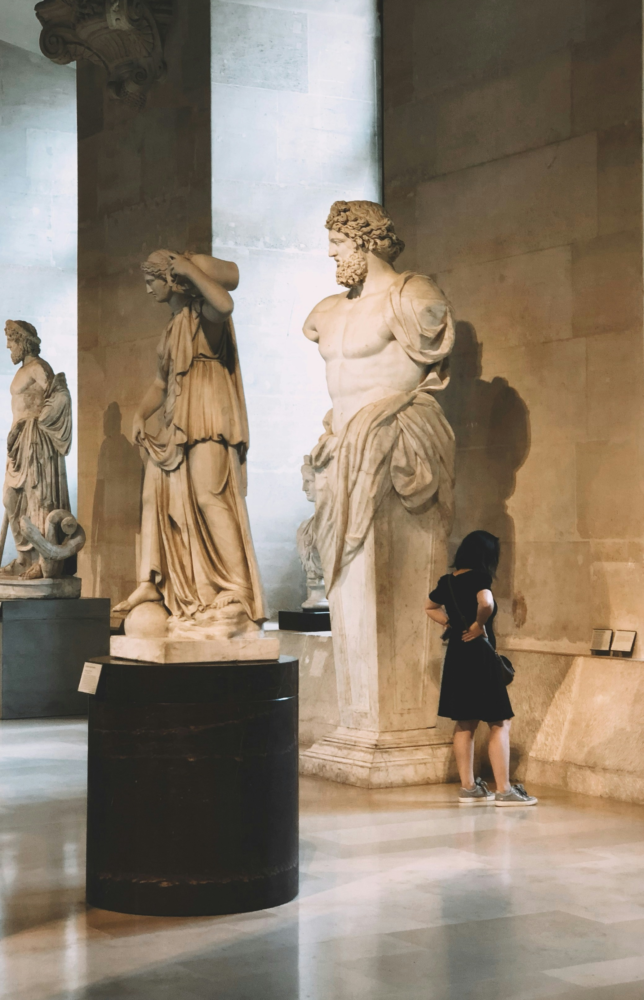

The Louvre, in addition to looking simply incredible with its 17th century French renaissance architecture, boasts the richest art collection you will ever find in a museum. It is today one of the most visited places in the world, and each day some 25 000 visitors, mostly tourists, penetrate its intimacy looking for the so-called Louvre experience. The Louvre is 210 000 square meters of cultural heritage, spanning over hundreds of rooms interconnected in the most French way possible. So, in order to optimize their visit of the Mona Lisa owner, some people choose to pay for a tour and submit to their tour guide's pathing preferences, while others would sooner get lost between its walls alone, delegating the responsibility of finding the museum's Chefs d'œuvre to luck and panels. Being an amateur of museums myself, I have to admit that both solutions provide their own perks, fit different kind of people, and are *in fine* situational. For example, if your goal is to learn everything there is to learn about the art pieces, having a tour guide is undoubtedly the preferred choice, but if time is not of the essence for you and you would rather take your time and enjoy some independance as you walk across centuries-old corridors, then you should definitely favour the free access. But there is actually a third option one usually forgets to consider: you could enjoy the freedom of solo visiting while experiencing the best the museum has to offer by following a **predefined route**, ie: a series of steps arranged in a fashion that when followed allows for maximum art discovery and maximum autonomy within a rational time window. The Louvre itself suggests on its official website some routes for its visitors, they are in my opinion very good but aren't really daring enough as they miss some opportunities to make the visit more interesting by including some additional rooms. Having been in the Louvre one too many times, I thought I could come up with one or two routes of my own that (I hope) do not completely suck, this is what I am sharing with you in this article.

The routes I'm suggesting are destined to everyone, but more specifically to whoever is planning to visit the Louvre in the near future and wants to have the fullest experience in a reasonable time frame, say not more than 2 to 3 hours (because yes, you cannot and should not spend the entirety of your Paris trip in a museum, am I right ?).

Since we are talking about the largest art museum in the world, I couldn't think of a unique route that would singlehandedly cover all of the Louvre's main masterpieces in the aforementioned time window. Instead I thought it would be best to split it into two routes, each exploring different art pieces from different cultures and civilizations, with both taking anything from 1h30 to 2h30 of museum hiking. If you had to pick only one of these two, I would strongly suggest going for the first route, especially if 1/ it's your first time in this fantastic place and 2/ you are very eager on discovering the most famous pieces that give the Louvre its grandiose reputation. The first route focuses on the Denon wing of the museum, which includes famous paintings such as the Mona Lisa and La Liberté guidant le Peuple, as well as renown sculptures like The Dying Slave and Niké. The second route explores more niche and (sadly) underrated collections, belonging to the ancient near east and egyptian civilizations.

The present article is dedicated to the first route. You can check out the second one here.

[Step 1: entering the Denon wing](#step-1-entering-the-denon-wing)

<!-- <a name="step1"> -->

# Step 1: entering the Denon wing

<!-- </a> -->

Assuming you already bought your ticket and figured out that the main entrance of the museum is actually through the controversial glass pyramid, you should now be facing 3 different rising escalators, each opening the way to one of the 3 different wings of the Louvre. Head to the one that has *Aile Denon* written next to it, and do not forgot to grab one of those nice museum maps that are waiting for you at the welcome desk.

Walk through the ticket check, cross the corridor, then take the circular stairs on your right !

# Step 2: grand entrance in Salle du Manège
The Salle du Manège might not be the most impressive room in the museum, but it holds many fascinating sculptures. What makes it so unique is that it is one of the rare Louvre rooms in which you can find art pieces from more than 3 different civilizations and from different epochs. In this room, Ramsès II meets Alexander The Great meets a dying Seneca, amongst many others...

My two personal favourite pieces of the Salle du Manège are:

## Jupyter de Versailles: 
A bust of the Roman king of gods. A statue which, in my opinion, faithfully gives Jupyter the imposant and dominant stature that is so characteristic of him.

  

## The composite statue of Antinous:
The result of the combination of the body of Greek mythology hero Heracles and the head of Antinous, who was Roman emperor Hadrian's lover. After tragically drowning in the Nile, he was deified by the grieving emperor to be forever worshipped as a god. 

Leave the Salle du Manège through the big double door (which is located right where you popped in when you first took the circular stairs), say hi to the Louvre pyramid peeking through the window, and head left to the Galerie Michel-Ange.

# Step 3: first Chefs d'oeuvres in Galerie Michel-Ange

## Psyche revived by the kiss of love:
Directly to your left after you come in, you will find "Psyche revived by the Kiss of Love", a marble masterpiece which took Venitian artist Canova many years of trial and error before finally being completed. Take a good look at it, because it is one of the most famous sculptures in the Louvre (if not the world).

  

Yet somehow, Cavano's beautiful art is outshined by an even greater masterpiece in the Galerie Michel-Ange, the star of the room which comes in two distinct sculptures: The Dying Slave and The Rebellious Slave, by Michelangelo. 

## The Dying Slave and The Rebellious Slave:
I believe there is no need to introduce Michelangelo anymore, the work of this artist of the prodigious florentine Renaissance generation (along Da Vinci, Raphael, and Donatello) has fascinated the world and has been a notorious subject of study for many scholars. Even though he is mainly remembered for his David and the Sistine chapel's colorful ceiling, Michelangelo's other work should definitely be given attention. The Louvre posesses the twin sculptures of The Dying Slave and The Rebellious Slave, the former being a tad more popular than the latter. \
Something that I always find true about Michelangelo's work is that, regardless of whether you're an expert at appreciating art or not, when facing it you will always find yourself captivated by its tremendous beauty, softly mouthing "wow" as you understand the pure genius behind the art.

 

Instead of passing by the Slaves to go up the stairs sitting behind them, you will now turn around, walk back and leave the Galerie Michel-Ange from where you first entered in, say hi to the pyramid again, and walk forward to the Galerie Daru. 

# Step 4: Roman imperialism in Galerie Daru
The Galerie Daru is a large room whose two sides are populated by Roman and Etruscan antiquities, mainly status of those quirky Romans we have come to know (and love ?) as emperors. This is the perfect opportunity to put faces on those names you've probably heard in the past: Augustus (Octave), Trajan, Commodus, etc.

## The Borghese Gladiator and Vase:
For a few years now, the galerie has been home to two important antiquities from the notorious Italian Borghese Galerie: the Borghese Gladiator and Vase, which are considered as two of the most important legacies of the Hellenestic period. They are to be found at the entrance of the room. 

When you're done admiring the galerie's art, walk through it and climb up the main stairs.

# Step 5: the soaring wings of Palier Samothrace
# Step 6: a date with luxury in Galerie d'Apollon
# Step 7: welcome to the paintings realm of the Grande Galerie
# Step 8: the Italian masterpieces of Salle de la Joconde
# Step 9: taking a look at the British and American paintings of the Louvre
# Step 10: Romanticism and Neo-classicism go hand-in-hand in Salle Mollien and Salle Daru  
# Step 11: Coup de grâce with greek antiquities
