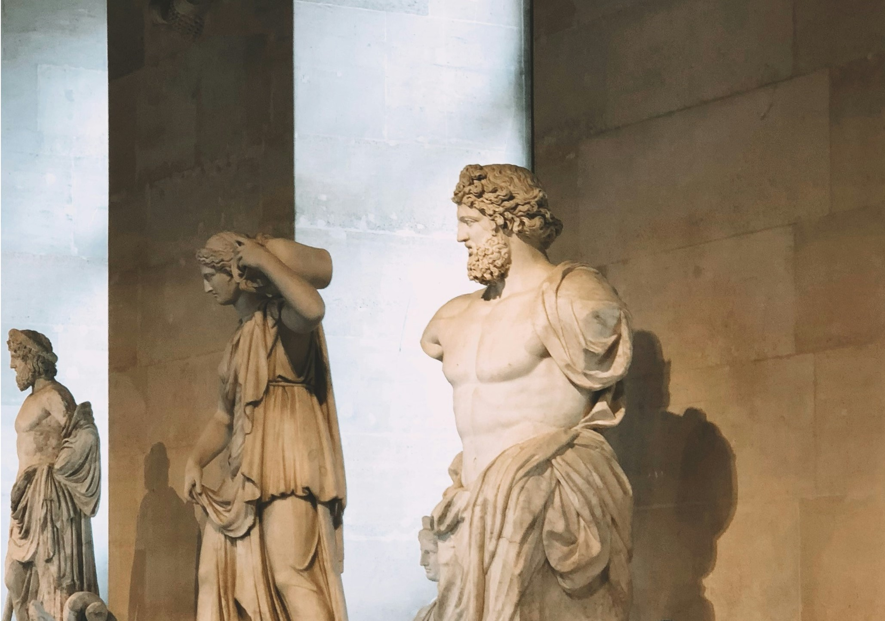
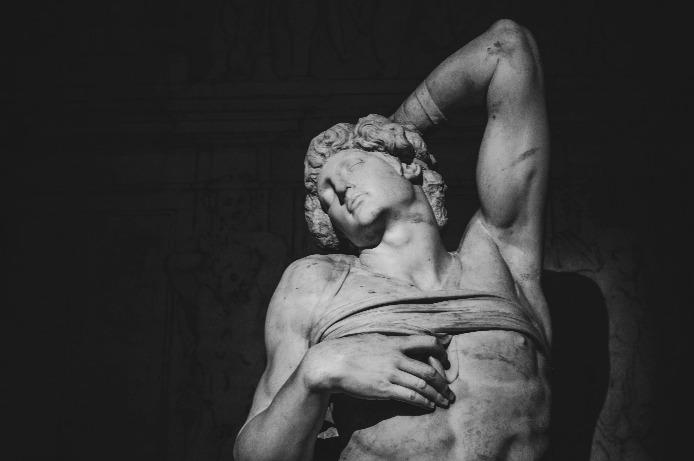
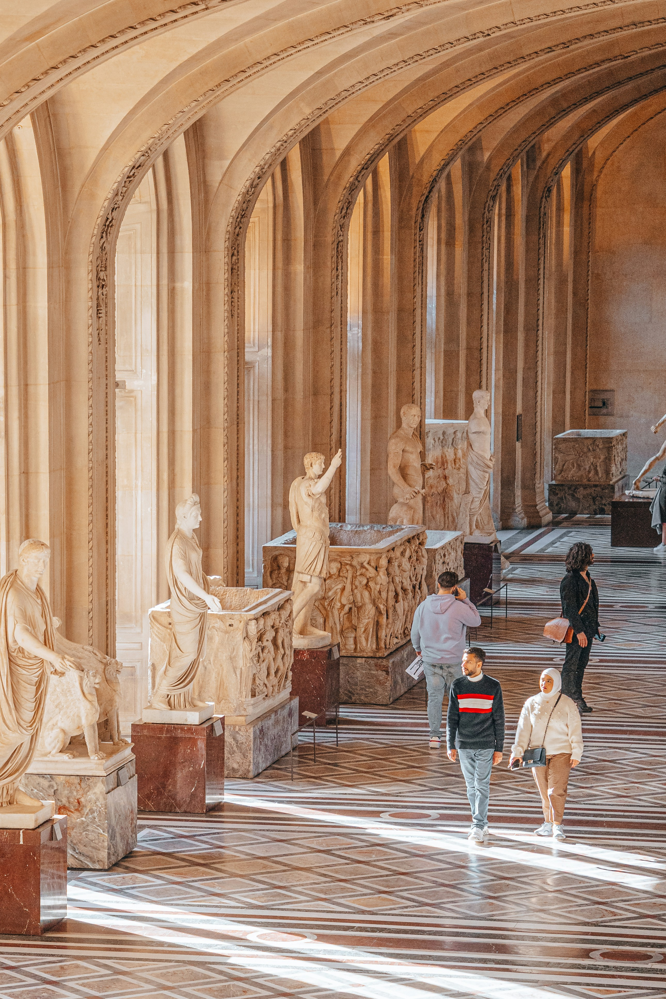
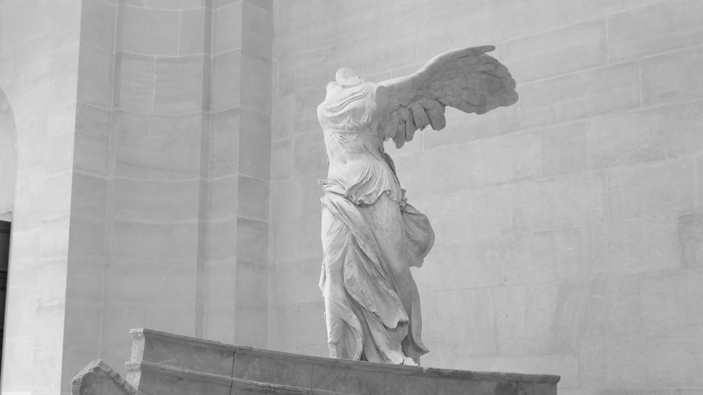

The Louvre, in addition to looking simply incredible with its 17th century French renaissance architecture, boasts the richest art collection you will ever find in a museum. It is today one of the most visited places in the world, and each day some 25 000 visitor penetrate its intimacy looking for the so-called Louvre experience. The Louvre is 210 000 square meters of cultural heritage, spanning over hundreds of rooms interconnected in the most French way possible. So, in order to optimize their visit, some people choose to pay for a tour and submit to their tour guide's pathing preferences, while others would sooner get lost alone between its walls, delegating the responsibility of finding the museum's Chefs d'œuvre to luck and panels. Being an amateur of museums myself, I have to admit that both solutions provide their own perks, fit different kind of people, and are *in fine* situational. For example, if your goal is to learn everything there is to learn about the art pieces, having a tour guide is undoubtedly the preferred choice, but if time is not of the essence for you and you would rather take your time and enjoy some independance as you walk across centuries-old corridors, then you should definitely favour the free access. But there is actually a third option one usually forgets to consider: you could enjoy the freedom of solo visiting while experiencing the best the museum has to offer by following a **predefined route**, ie: a series of steps arranged in a fashion that when followed allows for maximum art discovery and maximum autonomy within a rational time window. The Louvre itself suggests on its official website some routes for its visitors, they are in my opinion very good but aren't really daring enough as they miss some opportunities to make the visit more interesting by including some additional rooms. Having been in the Louvre one too many times, I thought I could come up with one route of my own that (I hope) does not completely suck, this is what I am sharing with you in this article.

The route I'm suggesting is destined to everyone, but more specifically to whoever is planning to visit the Louvre in the near future and wants to have the fullest experience in a reasonable time frame, say not more than 2 to 3 hours (because yes, you cannot and should not spend the entirety of your Paris trip in a museum, am I right ?).

  

Since we are talking about the largest art museum in the world, I couldn't think of a unique route that would singlehandedly cover all of the Louvre's main masterpieces in the aforementioned time window. Instead I thought it would be best to suggest one route that focuses on the best the Louvre has to offer. This trail is perfect if 1/ it's your first time in this fantastic place and 2/ you are very eager on discovering the most famous pieces that give the Louvre its grandiose reputation. This trail revolves entirely around the Denon wing and some part of the Sully Wing, which include famous paintings such as the *Mona Lisa* and *The Liberty Guiding the People*, as well as renown sculptures like the *Venus of Milo* and *The Victory of Samothrace*.\
But of course there are other masterpieces that might be niche but are still worth discovering in other parts of the museum, I listed most of them at the end of the article. If you still have time at the end of your tour, you should definity try and take a look at them.

Enjoy !

## Summary: 
- [Step 1: entering the **Denon wing**](#step1)

- [Step 2: grand entrance in **Salle du Manège**](#step2)
- [Step 3: first Chefs d'oeuvres in **Galerie Michel-Ange**](#step3) 
- [Step 4: Roman imperialism in **Galerie Daru**](#step4)
- [Step 5: the soaring wings of **Palier Samothrace**](#step5)
- [Step 6: a date with luxury in **Galerie d'Apollon**](#step6)
- [Step 7: welcome to the paintings realm of the **Grande Galerie**](#step7)
- [Step 8: the Italian masterpieces of **Salle de la Joconde**](#step8)
- [Step 9: taking a look at the **British and American** paintings of the Louvre](#step9)
- [Step 10: Romanticism and Neoclassicism go hand-in-hand in **Salle Mollien** and **Salle Daru**](#step10)
- [Step 11: Coup de grâce with **greek antiquities**](#step11)

<a name="step1">

# Step 1: entering the Denon wing

</a>

Assuming you already bought your ticket and figured out that the main entrance of the museum is actually through the controversial glass pyramid, you should now be facing 3 different rising escalators, each opening the way to one of the 3 different wings of the Louvre. Head to the one that has *Aile Denon* written next to it, and do not forgot to grab one of those nice museum maps that are waiting for you at the welcome desk.

Walk through the ticket check, cross the corridor, then take the circular stairs on your right !

<a name="step2">

# Step 2: grand entrance in Salle du Manège
</a>

The Salle du Manège might not be the most impressive room in the museum, but it holds many fascinating sculptures. What makes it so interesting is that it is a place in which you can find art pieces from multiple civilizations from different epochs. In this room, Ramsès II meets Alexander The Great meets a dying Seneca, amongst many others...

My two personal favourite pieces of the Salle du Manège are:

## Jupyter de Versailles: 
A bust of the Roman king of gods. A statue which, in my opinion, faithfully gives Jupyter the imposant and dominant stature that is so characteristic of him.

  

## The composite statue of Antinous:
The result of the combination of the body of Greek mythology hero Heracles and the head of Antinous, who was Roman emperor Hadrian's lover. After tragically drowning in the Nile, he was deified by the grieving emperor to be forever worshipped as a god. The statue is to be find at the back of the room.

Leave the Salle du Manège through the big double door (which is located right where you popped in when you first took the circular stairs), say hi to the Louvre pyramid peeking through the window, and head left to the Galerie Michel-Ange.

<a name="step3">

# Step 3: first Chefs d'oeuvres in Galerie Michel-Ange
</a>

## Psyche revived by the kiss of love:
Directly to your left after you come in, you will find "Psyche revived by the Kiss of Love", a marble masterpiece which took Venitian artist Canova many years of trial and error before finally being completed. Take a good look at it, because it is one of the most famous sculptures in the Louvre (if not the world).

  

Yet somehow, Canova's beautiful art is not the only star inhabiting the Galerie Michel-Ange, there is another diva in the room and it comes in two distinct sculptures: The Dying Slave and The Rebellious Slave, by Michelangelo. 

## The Dying Slave and The Rebellious Slave:
I believe there is no need to introduce Michelangelo anymore, the work of this artist of the prodigious florentine Renaissance generation (along Da Vinci, Raphael, and Donatello) has fascinated the world and has been a notorious subject of study for many scholars. Even though he is mainly remembered for his David and the Sistine chapel's colorful ceiling, every single artpiece by Michelangelo could be considered a masterpiece. The Louvre posesses the twin sculptures of The Dying Slave and The Rebellious Slave, the former being a tad more popular than the latter. \
Something that I always find true about Michelangelo's work is that one does not need to be an art expert to be able to appreciate it. You will no matter what find yourself captivated by its tremendous beauty, the genius of this artist was on an entirely different level.

 

Instead of passing by the Slaves to go up the stairs sitting behind them, you will now turn around, walk back and leave the Galerie Michel-Ange from where you first entered in, say hi to the pyramid again, and walk forward to the Galerie Daru. 

<a name="step4">

# Step 4: Roman imperialism in Galerie Daru
</a>

The Galerie Daru is a large room whose two sides are populated by Roman and Etruscan antiquities, mainly status of those quirky Romans we have come to know (and love ?) as emperors. This is the perfect opportunity to put faces on those names you've maybe heard in the past: Augustus, Trajan, Commodus, etc.

## The Borghese Gladiator and Vase:
For a few years now, the galerie has been home to two important antiquities from the notorious Italian Borghese Galerie: the Borghese Gladiator and Vase, which are considered as two of the most important legacies of the Hellenestic period (323 BCE - 31 BCE). They are to be found at the entrance of the room. 

When you're done admiring the galerie, wave goodbye to the emperors as you cross the room, then climb up the main stairs.

<a name="step5">

# Step 5: the soaring wings of Palier Samothrace
</a>

Now this is a sight to behold ! \
Atop the colossal main stairs of the Louvre stands a headless Greek Goddess named Niké. With wings widespread, she lands on the prow of a ship, announcing a forthcoming victory for her believers, or perhaps she is ready to take her flight, joining her fellow gods in mount Olympus.

The *Winged Victory of Samothrace* is perhaps the most important sculpture that popped out of the Hellenestic period. It was discovered by French archaeologist Champoiseau in the island of Samothrace in the northern Aegean sea during the 19th century, and it has ever since been a denizen of the Louvre, one of the many jewels the museum is delighted to exhibit. Despite missing her head and a few limbs, the goddess looks stunning ! It is one of the rare Hellenestic sculptures that endured the test of time and which are not known through Roman replicas.

To fully appreciate the sculpture and all of its majesty, art experts advise not to stand in front of it but rather move slightly sto the right or left so that you could have a 3/4 view of the masterpiece.

Onto our next step ! As you face the statue, go left and enter the circular room known as the *Rotonde de la Galerie d'Apollon* (in which are engraved the names of the most important and critical donators of the Louvre), then walk right into the worldrenown *Galerie d'Apollon*.

<a name="step6">

# Step 6: a date with luxury in Galerie d'Apollon
</a>

Stupor and amazement are what usually strike people when they first penetrate the Galerie d'Apollon. The room, named after the Greek God of light and arts Apollo, is the closest experience you can get to a Versailles castle visit while inside the Louvre, since it was designed by the same great minds who would architect a few years later Versailles under king Louis XIV's orders. Moreoever, it is because of this room and its symbol that this extravagant monarch began to be known as the Sun King.

In this galerie, anything your eyes lie on is a Classicism gem, but not only figuratively speaking ! Indeed, what is displayed today in the center of the hall is Louis XIV's gem collection, including 3 diamonds that once belonged to old royal families: *le Régent*, *l'Hortensia*, *le Sancy*.

At the back of the galerie, you will find a door that takes you to your next destination.
<a name="step7">

# Step 7: welcome to the paintings realm of the Salon Carré and the Grande Galerie
</a>

## Salon Carré

Exit sculptures and decorative arts, enter paintings ! (For now at least...)

The *Sallon Carré*, one of the most iconic Louvre rooms, is today filled with paintings of christian subjects. The Virgin, the Christ, and the Biblical Magi (among many others) are the stars of this place. It also posesses one of the most beautifully crafted ceilings that can be found in the museum.

If you happen to be a Sandro Botticelli fan, you will be happy to know that the Renaissance artist has some of his work exhibited in the Louvre. In the *Sallon Carré*, one can take a look at the *The Virgin and the Child* and *Three Scenes from the Story of Esther*, and if you dare exit the room from the right and walk towards the main stairs, you will encounter two frescoes by Botticelli: *Venus and the Three Graces Presenting Gifts to a Young Woman* and *A Young Man Being Introduced to the Seven Liberal Arts*. (If you decide to venture to see the frescoes, walk back to the *Sallon Carré* when you're done).

Leave through the door that faces the Galerie d'Apollon (from which you came in), and walk into the Grande Galerie.

## Grande Galerie

Here is another iconic Louvre galerie, a long majestic hall in which a great collection of Italian paintings is displayed. For a lot of people, this is the image that is conjured when their mind thinks of the Louvre. 

Every artpiece in this galerie is worth to look at, but the most notable ones are Mantegna's *Saint Sebastian*, Da Vinci's *The Virgin and the Child* and *La Belle Ferrionnière*, and Ghirlandaio's *An Old Man and His Grandson*.

You must have noticed on your way here a multitude of signs that show the way to the Mona Lisa. Instead of walking through the entirety of the hall, you will follow the Mona Lisa sign of the Grande Galerie into the *Salle des Etats* for a quick detour to see the Renaissance lady. 

<a name="step8">

# Step 8: the Italian masterpieces of Salle des Etats
</a>

## The Mona Lisa
The *Salle des Etats* is home to the Mona Lisa, the most famous, visited, written about, parodied, but also misunderstood work of art in the world. It was painted during the first years of the 16th century by master Leonardo Da Vinci, and portrays the noblewoman Lisa del Giocondo (who has quite the enigmatic expression on her face). Part of what made the artpiece so famous was its 1911 robbery by Peruggia, an Italian patriot who believed the painting belonged to Italy, even though he tried selling it two years after the theft.

Chances are the room is overcrowded and you find no space to approach Da Vinci's masterpiece. If that is the case, I sympathize with you. But do not despair, one can find in the *Salle des Etats* other chefs d'oeuvres that are, in my opinion, equally impressive as the Mona Lisa. 

## Veronese
Starting with the one that directly faces the Italian lady: *The Wedding Feast of Cana* by Paolo Veronese. In addition to being the largest painting of the Louvre, this monumental painting also depicts 130 different characters, enough for a game of "Where is Wall...Jesus ?".

Two other Veroneses that should not be overlooked are *Supper at Emmaus*, after the biblical story of the Emmaus pilgrims who recognized and invited a resurrected Christ for supper, and *Jupyter Hurling Thunderbolts at the Vices*, which used to be a ceiling decoration at the Venitian Doge's Palace before being gifted to the Louvre.

## Titian and Tintoretto
Somehow, there are even more Renaissance big names who have their work exhibited in the small *Salle des Etats*, such as the Titian and Tintoretto. These two Venitian artists are experts at using colours, be it the sfumato or the chiaroscuro, and their legacy was a source of inspiration for many future artists, with Tintoretto being known today as the precursor of Baroque art. In this room you can take a look at Titian's *Pastoral Concert* and *Woman with a Mirror*, and Tintoretto's *The Coronation of the Virgin*.

Instead of exiting the room through the large door that is behind the Mona Lisa, rejoin the *Grande Galerie* and keep walking until you find a little door on your right, take it.

<a name="step9">

# Step 9: taking a look at the British and American paintings of the Louvre
</a>

Not many American and British artists have reached the notoriety of the Italians, but quite a few have left their mark and influenced many generations to come, amongst them William Turner, Gainsborough, and Reynolds. The Louvre is lucky enough to have some of their art displayed in these two blood-colored dark rooms you are in: Reynolds' *Master Hare*, William Turner's *Landscape with a River and a Bay in the Background*, and Gainsborough's famous *Conversation in a Park*.

Yet, my personal favourite of the room was done by a lesser known British artist who specialized in dramatic landscapes and fantastic compositions: John Martin. His *Pandaemonium* painting never fails to send chills down my spine with its dark religious theme and its serpent-decorated frame, supposedly made by the artist himself, which adds to the overall experience. 

Cross the two rooms until you find the little *café Mollien*, where you can have some respite if needed, then walk onto *Salle Mollien* for our penultimate step.

<a name="step10">

# Step 10: Romanticism and Neoclassicism go hand-in-hand in Salle Mollien and Salle Daru  
</a>

The two rooms you are about to discover are probably my favourite places of the Louvre, god knows how many hours I have spent looking at the masterpieces that hang on their walls. While both of them exclusively exhibit French artists from the 19th century, *Salle Mollien*, the first one, is dedicated to romanticism, while *Salle Daru* focuses on the Neoclassicism movement.

## Salle Mollien
Romanticism was initially Europe's response to the age of englightenment and the industrial revolution. It is a movement that calls for the appreciation of passion, feelings, and nature, and seeks to bring people closer to their human identity. Although many art experts would argue it is more nuanced than that, it is in a way the antithesis of Neoclassicism (which you will encounter in the next room).\
And thus, most of the paintings you will find in *Salle Mollien* belong to this Romanticism movement, and were made by artists who had a specific goal in mind: to convey emotions to the observer.

Delacroix, great French master of Romanticism is the author of many of the paintings in *Salle Mollien*. The most notable ones are *Liberty Leading the People*, *Women of Algiers in their Appartments*, *Scenes from the Massacre at Chios*, and my favourite *The Death of Sardanapalus*. Fun fact: the latter was seen as an abomination by many of Delacroix's contemporaries when he first unveiled it, only time was able to prove the painter's genius.

Another French renown painter of the 19th century was Géricault, in this galerie you can admire his most precious work: *The Raft of the Medusa*, which tells (in a dramatic and *romantic* way) the 18th century story of the French naval frigate *Méduse*, whose wreck caused the few survivors to endure extreme conditions of starvation and dehydration and resort to cannibalism, only 15 out of 147 survived. This painting is the best example of how Romanticism aims to move the observer, in this case by building in them a sense of sadness and despair.

Cross the galerie, take a look at the little souvenir boutique that occupies the squared *Salle Denon* if you wish, then enter *Salle Daru*.

## Salle Daru
Neoclassicism was born in opposition to the Rococo style which was the dominating art movement of the 18th century. It focused on simplicity, clarity, and symmetry, and had a clear preference for representing scenes from Greco-Roman antiquity. Neoclassicism eventually had to compete with Romanticism, which had emerged as a reaction to the rigidity and lack of sensuality of the former.

The artist who led the Neoclassicism wave in France was Jacques-Louis David. David is the perfect example of what would be considered today a "history nerd", and this definitely could be seen in his art as he represented many little-known stories from classical antiquity. Some of my favourite David paintings that are exhibited in the Louvre and that I believe should not be missed are *The Coronation of Napoleon*, *Leonidas at Thermopylae*, and the eternal *oath of the Horatii*.

David had many apprentices who history has come to remember as the *Davidians*, some of them kept his art philosophy alive by following the Neoclassicism route. The most notable ones are Girodet-Trioson, and Ingres, whose work surround their master's in *Salle Daru*, such as Ingres' *The Apotheosis of Homer* (which sees Homer deified in the presence of some of history's most influential personnages) and Girodet-Trioson's *Scene from a deluge* (a representation of the mythical catastrophe known as the deluge, a painting is actually closer to Romanticism than Neoclassicism).

Leave *Salle Daru* and take the main stairs but not all the way down. As you reach the first landing, turn right (or left) and walk behind the stairs. 

<a name="step11">

# Step 11: Coup de grâce with Greek antiquities
</a>

The final step is a series of rooms which display many formidable Greek antiquities. One of these antiquities is the cherry on the cake of this trail and perhaps the most important artpiece the Louvre posesses (after the Mona Lisa) ! 

Indeed, if you walk forward a bit, you will discover on your right the stunning *Venus of Milo*, a Hellenestic marble statue representing an armless Greek goddess Aphrodite (or Venus according to Roman mythology), which was discovered on the Greek island of Milo (hence the name). The artist is currently unknown. Its first exhibition in the 19th century made quite some noise, as people rushed to the museum to admire Venus' beauty and wonder what the full sculpture must have looked like.

What faces the statue are many other beautiful sculptures of Aphrodite/Venus, but if you enter the room that is on the left of the *Venus of Milo*, you will come upon the historic *Salle des Caryatides*. The caryatides are the 4 woman-like pillars that hold the entrance/exit of the room. They were sculpted during the 16th century, inspired by the ones found in Athens' Acropolis.\
This room also accomodates in its center the most famous sculpture worldwide of Artemis/Diane, which depicts the Greek/Roman goddess of the hunt accompanied by a little deer, pulling an arrow from her quiver.

This is the end of the trail! When you're done, you can walk through the Caryatides and go downstairs. You will end up in the central plaza of the Louvre.

As I mentioned before, there are many, many others works of art in this gigantic museum that deserve some attention, but no sane person actually dares to do the entirety of the Louvre in a single tour. What I suggest to you below is a list of masterpieces that can be found in rooms you have not yet visited and which, in my humble opinion, deserve the detour if you have some time on your hand (or if perhaps you plan on visiting the museum again). Otherwise, I deeply hope the tour was very pleasing and easy to follow, and that it made you fall in love with this culturally rich place as much as I do.

# Other works of art you should not miss out on: 
## The Code of Hammurabi:
I'm a big sucker for Mesopotamia history, and even though it is terribly underrated, I present to you one of Mesopotamia's most important legacies: the Code of Hammurabi. This is one of the world's first laws ever, made by Babylonian king Hammurabi in the 18th century BCE. You can learn about some of its rules on the posters that accompany it.

Location: 

## The Palace of Sargon II (The Khorsabad Courtyard):
Delve into the beautiful palace of Assyrian king Sargon II, decorated with plenty bas-reliefs and *Lamassus* (winged creatures with the lion bodies and kings faces, meant to prevent bad spirits from entering the palace).

Location:

## The Marly and Puget Courtyards:
These are places you have perhaps seen pictures of, you might even have been excited to visit them, and subsequently disappointed to find out they were't part of the tour (if that's the case, sorry, it was hard to fit everything!).\
Nevertheless, it's always possible to enter the Richelieu Wing to enjoy these beautiful neighbouring piazzas, which are occupied by beautiful French sculptures. Do not miss out on the *Horses of Marly*!

Location:

## Napoléon III's appartments:
As you may know, the Louvre has not always been a museum, it served as the residences for both kings and emperors. Today, you can visit the newly renovated appartments of Napoléon III. Luxurious decorative objects and pretty colours are on the agenda.

Location:

## The Seated Scribe:
The only Egyptian sculpture of this list, the *Seated Scribe* is one of the Louvre's treasures. It represent a sitting scribe, a man whose job was to write administrative or religious texts, akin to an official today. What makes the limestone statue so popular is the incredible state in which it was found, the paint was almost intact.

Location:

